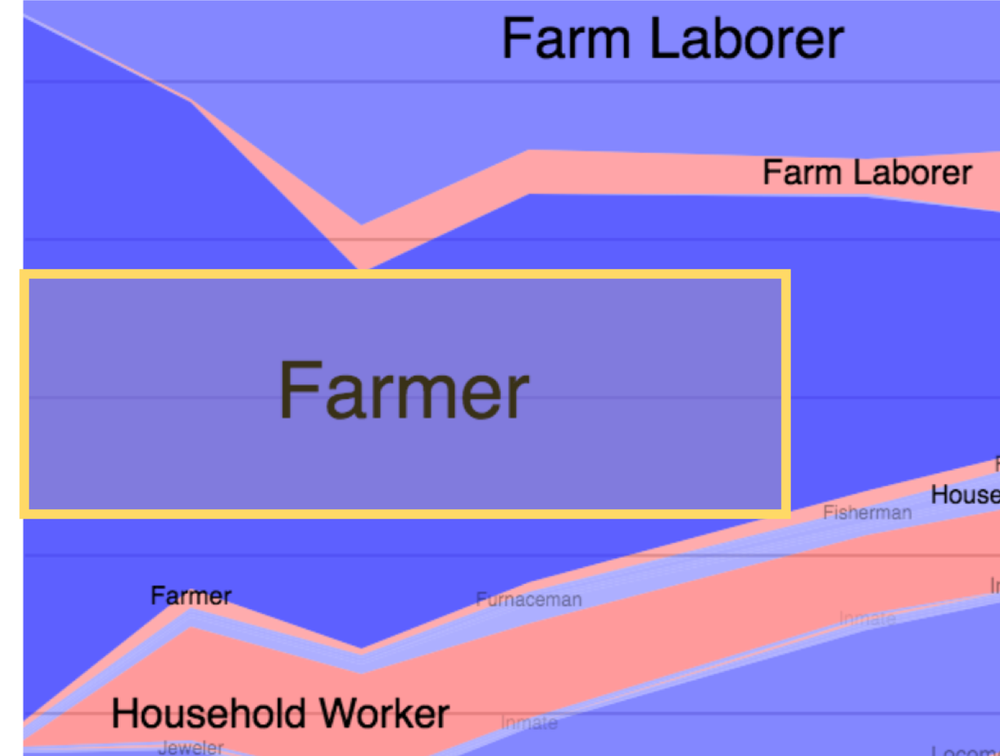

# Vega-Label

The **label** transform repositions texts in text mark, so that their placements are not colliding with other elements in the chart. Those elements include marks that have name included in property `avoidMarks` and the mark that is used as backing data (as explained in [reactive geometry](https://vega.github.io/vega/docs/marks/)) of the text mark this label transform is transforming.

The label transform is useful for labeling data points by creating a text mark that takes in data from the mark that represents the data point (we will call this 'base mark' for this label documentation), then use the label transform on the text mark to reposition the text, so that the texts appear near their data points without colliding into other objects in the chart.

## Transform Parameters

| Property      |              Type               | Description                                                                                                                                        |
| :------------ | :-----------------------------: | :------------------------------------------------------------------------------------------------------------------------------------------------- |
| sort          |     | the field indicating order of labels to be placed (**greater** will be placed **after**).                                                          |
| padding       |    | the amount of pixels label can extend pass chart bounding box.                                                                                     |
| size          |  |  size of the chart in format `[width, height]`. **This size have to match with the chart size**.                             |
| anchor        |                                                                                                                                           | list of anchor points of labels relative to its base mark's bounding box that you want Vega-Label to consider placing. The available options are `"top-left"`, `"left"`, `"bottom-left"`, `"top"`, `"bottom"`, `"top-right"`, `"right"`, `"bottom-right"`, `"middle"`. Can also be specified as a single anchor point. |
| offset        |                                                                                                                                           | list of offset of labels relative to its base mark's bounding box. This list is parallel to the list of anchor points. This property can also be specified as a single number for a constant offset through every anchor point |
| avoidMarks    |  | list of names of marks. Labels will not be placed in collision with these marks.                                                                   |
| padding       |    | the amount of pixels extending from the chart bounding box as an available space for labels to be placed.                                          |
| avoidBaseMark |   | a flag specifying if labels can collide their base mark (from reactive geometry) or not.                                                           |
| lineAnchor    |    | an anchor point for group line mark can be `begin` or `end`. **Note**: this flag only work with group line mark as a base mark.                    |
| markIndex     |    | an index to specify which mark in the group is to used to calculate anchor points for labels. **Note**: this only work with base mark type `group` |

## Usage

TODO: add usage

<!-- ```json
"transform": [
  {
    "type": "label",
    "size": [800, 500],
    "padding": 0,
    "anchor": [
      "top-left",
      "left",
      "bottom-left",
      "top",
      "bottom",
      "top-right",
      "right",
      "bottom-right",
    ],
    "offset": [ 1, 1, 1, 1, 1, 1, 1, 1 ],
    "sort": { "field": "datum.year" },
    "avoidMarks": [ "basePoint", "baseLine" ],
    "avoidBaseMark": true,
    "lineAnchor": "end",
    "markIndex": 0,
  }
]
```

- `sort`: order of label to be placed (**greater** will be placed **after**).

- `size`: size of the chart in format `[width, height]`. **This size have to match with the chart size**.

- `anchor` and `offset`: parallel arrays of anchor points and offset values.

  - `anchor`: list of anchor points of labels to its mark's bounding box.

    - From the example above, for each label, Vega-Label will try to place it at the `middle` first, relative to its mark.
    - If it collide with some other mark or label, Vega-Label will try to place it at the `right`, relative to its mark.

  - `offset`: list of offset values from the bounding box of the **base mark**.
    - From the example above, Vega-Label will try to place label with no offset.
      - **Note**: if the parallel anchor is `middle`, the offset value should be `null`. Otherwise, the value is ignored.
    - If it cannot place the label, Vega-Label will try to place label with offset value 2.
    - If it cannot place the label, Vega-Label will try to place label with offset value 1 inside its mark.
      - **Note**: label will be placed inside its mark if offset is negative.

- `avoidMarks`: list of data of mark; labels will not collide with these marks.

- `padding`: the amount of pixels label can extend pass chart bounding box.

- `avoidBaseMark`: a flag specifying if labels are avoiding base mark (from reactive geometry) or not.

  - If this flag is `false`, Vega-Label only uses base mark to calculate anchor points for label but not mark to be avoided.

- `lineAnchor`: an anchor point for group line mark can be `begin` or `end`.

  - If `lineAnchor` is `begin`, label is at the beginning of the line. Otherwise, label is at the end of the line.
  - **Note**: this flag only work with group line mark as a base mark using reactive geometry.

- `markIndex`: use when the reactive geometry's mark type is `'group'`.

  - To specify which mark in the group is to used to calculate anchor points for labels.

- label transform has to be used with reactive geometry to use it as base mark to calculate positions of label.
  - Right now, Vega-Label works with `symbol`, `line`, `rect`, and `group` of `line` and `area`. -->

## Setting up Vega-Label Instructions

Right now, Vega-Label cannot be integrated into Vega yet.

However, for trying vega-label, first clone this repository

We assume you have [yarn](https://yarnpkg.com/en/) and [python](https://www.python.org/) installed (python is not necessary for running Vega, just for serving demo website).

1. Install the dependencies and build Vega-Label:

```
$ yarn && yarn build
```

2. Serve the demo site with python:

```
$ python -m SimpleHTTPServer
```

3. In browser, go to http://localhost:8000/demo.html to see demo for a Vega-Label example.

4. In demo.js, uncomment a spec name to try other examples, or try your own spec by putting them in directory `specs` with name format `label_SPECNAME.vg.json`.

## Examples of Vega-Label

### With area

#### In Stacked Area Chart - Job Voyager Example


Groups of area are used as the base mark, but `avoidBaseMark` flag is `false`, so labels can collide with their marks, but not to each other. Here is the [Vega Specification](./specs/label_area_job_voyager.vg.json).

|                                                                                                                                                                                                                                                                                                                                                        |                                                                      |
| ------------------------------------------------------------------------------------------------------------------------------------------------------------------------------------------------------------------------------------------------------------------------------------------------------------------------------------------------------ | -------------------------------------------------------------------- |
| This example is from Vega [Job Voyager Example](https://vega.github.io/vega/examples/job-voyager/). In the original example, each label is placed at the position that has the widest vertical space in the area.                                                                                                                                      |      |
| When adding label using text with label transform, each label is placed at the position that has the largest rectangle (with the same ratil as the label) fitting in the area. This method is better because label transform considers both horizontal and vertical space, so it is more likely for the label to be placed completely inside the area. |  |

### With line

#### In Connected Scatter Plot - Connected Scatter Plot Example


Symbol is used as the base mark to label, and line is the mark to avoid when labeling. Here is the [Vega Specification](./specs/label_line_connected_scatter.vg.json).

This example is from Vega [Connected Scatter Plot Example](https://vega.github.io/vega/examples/connected-scatter-plot/). In the original example, the position of each label is pre-calculated into the dataset. Therefore, both the dataset and the vega spec depend on each other.

By adding label using text with label transform, the position of each label is calculated based on the object in the chart, so making changes to dataset or vega spec is more flexible.

#### In Grouped Lines Chart - Carbon Dioxide in the Atmosphere


Groups of line are used as the base mark to label, so one label is placed at the end of each line. Here is the [Vega Specification](./specs/label_line_end.vg.json).

This example is inspired by Vega-Lite [Carbon Dioxide in the Atmosphere](https://vega.github.io/vega-lite/examples/layer_line_co2_concentration.html). In the original, Vega-Lite example, we need to find the begining and the end data points of each line, and mark them as begin/end. Then, place labels twice. First time, place each label at the lower-right of its data point, and filter out all the labels except the beginning labels. Second time, do the same but place each label at the upper-right of its data point, and filter out all the labels except the end labels. This process is complicated, and may cause inefficiency by transforming and filtering out most of the labels.

By adding label using text with label transform in Vega, labels are automatically positioned at the end of each lines when the text mark's data is backed by the group-line mark using reactive geometry.

### With rect

#### In Stacked Bar Chart - Stacked Bar Chart Example


Rect is used as the base mark to label. There are 2 sets of labels in this chart. The first label is the overall height of each combined bars, and label positions is set to the outer top of each bar. The second label is the height of each bar, and label position is set to the inner top of each bar Here is the [Vega Specification](./specs/label_rect_stack.vg.json).

This example is inspired by Vega [Stacked Bar Chart Example](https://vega.github.io/vega/examples/stacked-bar-chart/). The original example does not have label on the chart.

When adding label using text with label transform, labels are placed in the available position, and they are hidden when there is not enough space (collision with the bar itself). The example is at the blue bars at `x = 3, 7` and the orange bars at `x = 8, 9`.

#### In Bar Bhart - Bar Chart Example


Rect is used as the base mark to label. The label position is set to inner right of each bar as default, and outer right if bar is too small. Here is the [Vega Specification](./specs/label_rect.vg.json).

### With symbol

#### In Scatter Plot - Asteroid Positions


Symbol is used as the base mark to label. Here is the [Vega Specification](./specs/label_scatter_asteroids.vg.json).

The data is from The Data Intensive Research in Astrophysics and Cosmology at the University of Washington.
