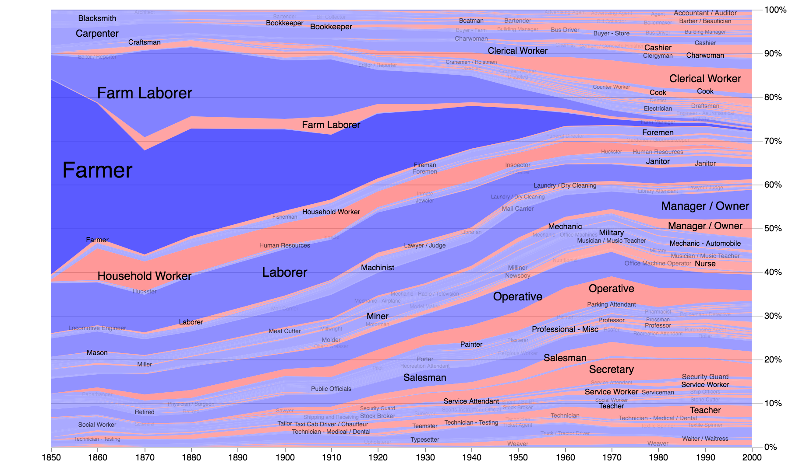
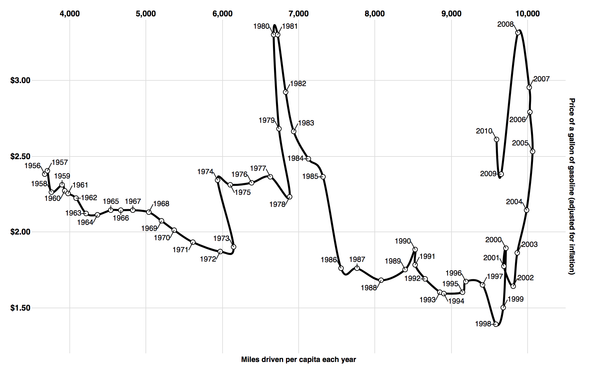
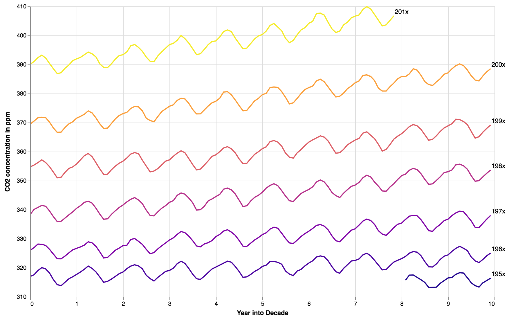
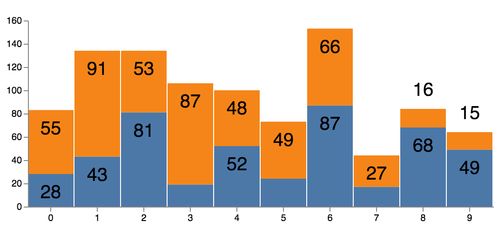
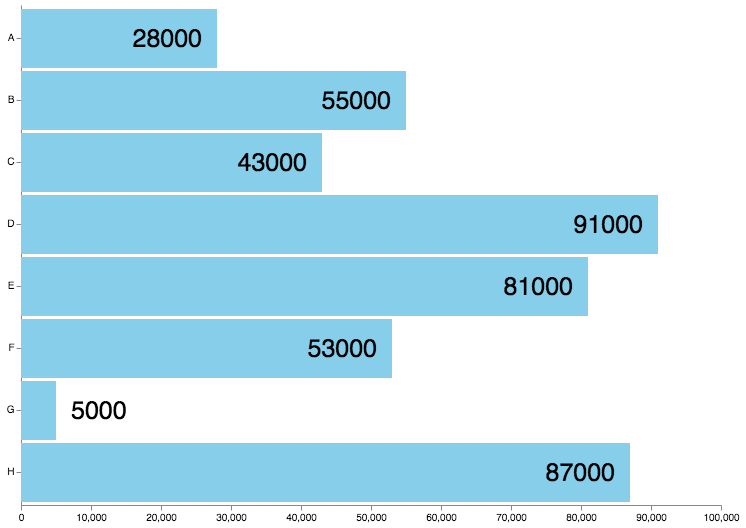
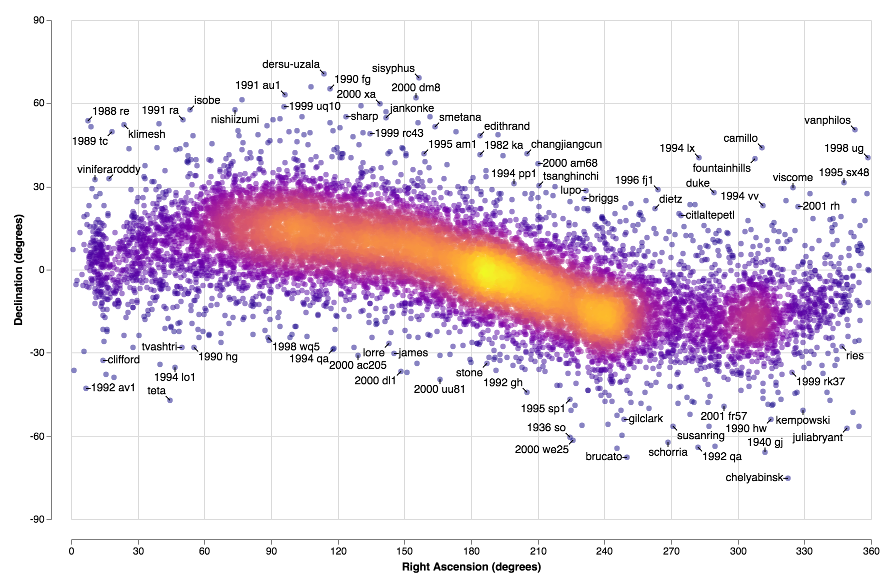

# Vega-Label

Vega-Label is a post-encoding transform for [Vega](https://github.com/vega/vega), which transform text mark into readable label based on mark type.

[](https://github.com/prettier/prettier)

## Syntax for label transform

```json
"transform": [
  {
    "type": "label",
    "size": [800, 500],
    "padding": 0,
    "anchor": [
      "top-left",
      "left",
      "bottom-left",
      "top",
      "bottom",
      "top-right",
      "right",
      "bottom-right",
    ],
    "offset": [ 1, 1, 1, 1, 1, 1, 1, 1 ],
    "sort": { "field": "datum.year" },
    "avoidMarks": [ "basePoint", "baseLine" ],
    "avoidBaseMark": true,
    "lineAnchor": "end",
    "markIdx": 0,
  }
]
```

- `sort`: order of label to be placed (**greater** will be placed **after**)

- `size`: size of the chart in format `[width, height]`. **This size have to match with the chart size**

- `anchor` and `offset`: parallel arrays of anchor points and offset values.

  - `anchor`: list of anchor points of labels to its mark's bounding box

    - From the example above, for each label, Vega-Label will try to place it at the `middle` first, relative to its mark.
    - If it collide with some other mark or label, Vega-Label will try to place it at the `right`, relative to its mark.

  - `offset`: list of offset values from the bounding box of the **base mark**.
    - From the example above, Vega-Label will try to place label with no offset.
      - **Note**: if the parallel anchor is `middle`, the offset value should be `null`. Otherwise, the value is ignored.
    - If it cannot place the label, Vega-Label will try to place label with offset value 2.
    - If it cannot place the label, Vega-Label will try to place label with offset value 1 inside its mark.
      - **Note**: label will be placed inside its mark if offset is negative.

- `avoidMarks`: list of data of mark; labels will not collide with these marks

- `padding`: the amount of pixels label can extend pass chart bounding box.

- `avoidBaseMark`: a flag specifying if labels are avoiding base mark (from reactive geometry) or not.

  - If this flag is `false`, Vega-Label only uses base mark to calculate anchor points for label but not mark to be avoided.

- `lineAnchor`: an anchor point for group line mark can be `begin` or `end`

  - If `lineAnchor` is `begin`, label is at the beginning of the line. Otherwise, label is at the end of the line.
  - **Note**: this flag only work with group line mark as a base mark using reactive geometry.

- `markIdx`: use when the reactive geometry's mark type is `'group'`

  - To specify which mark in the group is to used to calculate anchor points for labels.

- label transform has to be used with reactive geometry to use it as base mark to calculate positions of label
  - Right now, reactive geometry works with `symbol`, `line`, `rect`, and `group` of `line` and `area`

# Examples of Vega-Label

## With area

### In Stacked Area Chart - Job Voyager Example



Groups of area are used as the base mark, but `avoidBaseMark` flag is `false`, so labels can collide with their marks. Here is the [Vega Specification](./specs/label_area_job_voyager.vg.json)

This example is from Vega [Job Voyager Example](https://vega.github.io/vega/examples/job-voyager/)

## With line

### In Connected Scatter Plot - Connected Scatter Plot Example



Symbol is used as the base mark to label, and line is the mark to avoid when labeling. Here is the [Vega Specification](./specs/label_line_connected_scatter.vg.json)

This example is from Vega [Connected Scatter Plot Example](https://vega.github.io/vega/examples/connected-scatter-plot/)

### In Grouped Lines Chart - Carbon Dioxide in the Atmosphere



Groups of line are used as the base mark to label, so one label is placed at the end of each line. Here is the [Vega Specification](./specs/label_line_end.vg.json)

This example is inspired by Vega-Lite [Carbon Dioxide in the Atmosphere](https://vega.github.io/vega-lite/examples/layer_line_co2_concentration.html)

## With rect

### In Stacked Bar Chart - Stacked Bar Chart Example



Rect is used as the base mark to label. There is 2 sets of labels in this chart. The first label is the overall height of each combined bars, and label positions is set to the outer top of each bar. The second label is the height of each bar, and label position is set to the inner top of each bar Here is the [Vega Specification](./specs/label_rect_stack.vg.json)

This example is inspired by Vega [Stacked Bar Chart Example](https://vega.github.io/vega/examples/stacked-bar-chart/)

### In Bar Bhart - Bar Chart Example



Rect is used as the base mark to label. The label position is set to inner right of each bar as default, and outer right if bar is too small. Here is the [Vega Specification](./specs/label_rect.vg.json)

## With symbol

### In Scatter Plot - Asteroid Positions



Symbol is used as the base mark to label. Here is the [Vega Specification](./specs/label_scatter_asteroids.vg.json)

The data is from The Data Intensive Research in Astrophysics and Cosmology at the University of Washington
